# Post-contenido Unidad 7: Gestión de Tareas con Spring Boot

**Estudiante:** Nicolás Andrés Sánchez Villamizar
**Materia:** Programación Web, Séptimo Semestre, Universidad de Santander (UDES)

## Descripción

Este repositorio tiene el laboratorio de la Unidad 7. Es un único proyecto Spring Boot (un solo `pom.xml` y un solo paquete raíz `com.universidad.tareas`) con dos capas que trabajan sobre el mismo `TareaService`:

- **Parte 1:** una vista web con `@Controller` y Thymeleaf en `/tareas` para listar con filtros, crear, editar, completar y eliminar tareas.
- **Parte 2:** una API REST con `@RestController` en `/api/tareas` que expone la misma información en JSON.

Las dos capas reciben por constructor la misma instancia de `TareaService` (un bean singleton de Spring), así que lo que se crea o borra por la API aparece o desaparece también en la vista web, y al revés. Los datos se guardan en memoria con un `Map`, porque la persistencia con JPA se ve en la Unidad 8.

## Prerrequisitos

- JDK 17 o superior (yo lo trabajé con JDK 23.0.1, el `pom.xml` compila con `release 17`).
- Apache Maven 3.8 o superior (usé Maven 3.9.16).
- Un navegador para la vista web y curl o Postman para la API.

## Estructura del proyecto

```
sanchez-post1-u7-pweb/
├── pom.xml
├── README.md
├── docs/capturas/                      capturas de la vista web y de la API
└── src/main/
    ├── java/com/universidad/tareas/
    │   ├── TareasApplication.java
    │   ├── model/
    │   │   ├── Prioridad.java          enum ALTA, MEDIA, BAJA
    │   │   └── Tarea.java              modelo compartido con Bean Validation
    │   ├── service/
    │   │   └── TareaService.java       repositorio en memoria y filtro combinable
    │   └── controller/
    │       ├── TareaController.java    vista Thymeleaf (parte 1)
    │       ├── TareaApiController.java API REST (parte 2)
    │       └── ApiErrorHandler.java    errores de validación en JSON (parte 2)
    └── resources/
        ├── application.properties
        └── templates/tareas/
            ├── lista.html
            └── formulario.html
```

## Cómo compilar y ejecutar

1. Clonar el repositorio: `git clone https://github.com/NicolasSnchz/sanchez-post1-u7-pweb.git`
2. Entrar a la carpeta: `cd sanchez-post1-u7-pweb`
3. Ejecutar: `mvn spring-boot:run` y esperar el mensaje `Started TareasApplication`.
4. Vista web: http://localhost:8080/tareas
5. API REST: http://localhost:8080/api/tareas

La aplicación arranca con tres tareas de ejemplo cuyas fechas se calculan a partir del día en que se ejecuta.

## Parte 1: Vista Thymeleaf con @Controller

`TareaController` atiende las rutas bajo `/tareas`:

| Método | Ruta | Qué hace |
|---|---|---|
| GET | `/tareas?prioridad=&completada=` | Lista las tareas, filtrando con `@RequestParam` (los dos filtros son opcionales y se pueden combinar) |
| GET | `/tareas/nueva` | Muestra el formulario vacío |
| GET | `/tareas/{id}/editar` | Muestra el formulario con los datos de la tarea |
| POST | `/tareas/guardar` | Valida con `@Valid` y `BindingResult`; si hay errores vuelve al formulario, si no redirige a `/tareas` |
| POST | `/tareas/{id}/completar` | Marca la tarea como completada y redirige a `/tareas` |
| POST | `/tareas/{id}/eliminar` | Elimina la tarea y redirige a `/tareas` |

## Parte 2: API REST con @RestController

| Método | URL | Código éxito | Código error | Descripción |
|---|---|---|---|---|
| GET | `/api/tareas` | 200 OK | | Lista en JSON, filtrable con `?prioridad=` y/o `?completada=` |
| GET | `/api/tareas/{id}` | 200 OK | 404 Not Found | Devuelve la tarea con ese id |
| POST | `/api/tareas` | 201 Created | 400 Bad Request | Crea la tarea del body y devuelve el header `Location`; 400 si falla la validación |
| PUT | `/api/tareas/{id}` | 200 OK | 404 / 400 | Reemplaza todos los campos de la tarea |
| PATCH | `/api/tareas/{id}/completar` | 200 OK | 404 Not Found | Actualización parcial: solo pone `completada = true` |
| DELETE | `/api/tareas/{id}` | 204 No Content | 404 Not Found | Elimina la tarea |

Ejemplos con curl (en Git Bash). La fecha límite tiene que ser de hoy en adelante por la regla `@FutureOrPresent`:

```bash
curl -i "http://localhost:8080/api/tareas?prioridad=ALTA&completada=false"

curl -i -X POST http://localhost:8080/api/tareas -H "Content-Type: application/json" -d '{"titulo":"Documentar la API","descripcion":"Agregar ejemplos de uso","prioridad":"MEDIA","fechaLimite":"2026-12-15"}'

curl -i -X POST http://localhost:8080/api/tareas -H "Content-Type: application/json" -d '{"titulo":"","prioridad":"ALTA","fechaLimite":"2026-12-15"}'

curl -i -X PATCH http://localhost:8080/api/tareas/4/completar

curl -i -X DELETE http://localhost:8080/api/tareas/4
```

## Decisiones de diseño

**1. Inyección por constructor en los dos controladores.** [`TareaController`](src/main/java/com/universidad/tareas/controller/TareaController.java#L24-L26) y [`TareaApiController`](src/main/java/com/universidad/tareas/controller/TareaApiController.java#L22-L24) reciben el `TareaService` por constructor y lo guardan en un campo `final`. Con un único constructor Spring inyecta la dependencia sin necesidad de `@Autowired` (desde Spring 4.3), la dependencia queda explícita en la firma y la clase se puede crear a mano en una prueba unitaria pasando un servicio de prueba, sin levantar todo el contexto. Con `@Autowired` en el campo eso no se puede, porque el campo solo lo llena el contenedor por reflexión.

**2. Un solo servicio singleton para las dos capas.** [`TareaService`](src/main/java/com/universidad/tareas/service/TareaService.java#L9-L13) es un `@Service`, y Spring crea una sola instancia por contexto. Por eso la vista y la API leen y escriben sobre el mismo `Map`. Esto se comprueba en las capturas 09 y 12: la tarea creada con POST en la API aparece en `/tareas`, y cuando se borra con DELETE deja de aparecer. El filtro se centralizó en [`filtrar()`](src/main/java/com/universidad/tareas/service/TareaService.java#L31-L41) para que la vista y la API no repitan la lógica; si un parámetro llega en `null` esa condición no se aplica, y así los dos filtros funcionan solos o combinados.

**3. Validación declarada una sola vez en el modelo.** Las reglas están como anotaciones en [`Tarea`](src/main/java/com/universidad/tareas/model/Tarea.java#L13-L25) y las usan las dos capas con `@Valid`, así que no hay reglas duplicadas que se puedan desincronizar.

**4. `@FutureOrPresent` en vez de `@Future` para la fecha límite.** En la [línea 24 de `Tarea`](src/main/java/com/universidad/tareas/model/Tarea.java#L24) se usa `@FutureOrPresent` porque una tarea que vence el mismo día en que se crea es un caso válido (algo urgente que se registra en la mañana y vence en la tarde). `@Future` exige una fecha estrictamente posterior a hoy y rechazaría ese caso.

**5. POST, y no GET, para completar y eliminar en la vista.** En [`TareaController`](src/main/java/com/universidad/tareas/controller/TareaController.java#L78-L89) y en los [formularios de `lista.html`](src/main/resources/templates/tareas/lista.html#L53-L60) estas acciones van por POST. Según HTTP, GET debe ser seguro y no cambiar el estado del servidor; si fueran enlaces GET, el precargador del navegador o un rastreador podría completar o borrar tareas solo por visitar la URL. Probé que un GET a `/tareas/3/completar` responde 405 Method Not Allowed.

**6. Patrón Post/Redirect/Get.** Cuando guardar, completar o eliminar salen bien, el controlador responde con `redirect:/tareas` (por ejemplo en la [línea 71](src/main/java/com/universidad/tareas/controller/TareaController.java#L71)). El navegador queda en un GET, entonces al presionar F5 no se reenvía el POST ni se repite la operación. Si la validación falla no se redirige, se vuelve a pintar el formulario para no perder lo que el usuario escribió.

**7. PATCH para completar en la API y PUT para el reemplazo completo.** [`PUT /api/tareas/{id}`](src/main/java/com/universidad/tareas/controller/TareaApiController.java#L51-L59) reemplaza el recurso entero y valida el body completo con `@Valid`. Para marcar una tarea como hecha se usa [`PATCH /api/tareas/{id}/completar`](src/main/java/com/universidad/tareas/controller/TareaApiController.java#L62-L67), porque es una modificación parcial de un solo atributo: con PUT el cliente tendría que reenviar título, descripción, prioridad y fecha solo para cambiar `completada`.

**8. Códigos HTTP que reflejan el resultado.** El POST devuelve [201 Created con el header `Location`](src/main/java/com/universidad/tareas/controller/TareaApiController.java#L44-L48) apuntando al recurso nuevo, el DELETE devuelve 204 No Content porque no hay cuerpo que mandar, y cuando el id no existe se devuelve 404 en GET, PUT, PATCH y DELETE.

**9. Dos mecanismos de validación, uno por capa.** En la vista se usa [`BindingResult` dentro de `guardar()`](src/main/java/com/universidad/tareas/controller/TareaController.java#L60-L72), porque ahí hay que volver a mostrar el formulario HTML con el mensaje debajo de cada campo. En la API se usa [`ApiErrorHandler` con `@RestControllerAdvice`](src/main/java/com/universidad/tareas/controller/ApiErrorHandler.java#L11-L25), que atrapa `MethodArgumentNotValidException` y devuelve un JSON `campo: mensaje` con 400. Sin ese manejador el cliente recibiría la respuesta de error genérica de Spring Boot, que no le dice qué campo está mal. Unificarlos obligaría a una de las dos capas a responder en un formato que no le sirve.

**10. Persistencia en memoria.** Se usa un `LinkedHashMap` en el servicio en lugar de JPA porque la persistencia real se ve en la Unidad 8. Se eligió `LinkedHashMap` y no `HashMap` para que la lista salga en el orden en que se crearon las tareas.

## Correcciones al enunciado

Al probar cada checkpoint encontré cuatro cosas del enunciado que no funcionaban como dice la guía. Las corregí con el cambio mínimo y aquí explico por qué.

**1. El título vacío no siempre devolvía "El título es obligatorio".** El checkpoint de la Parte 1 y el ejemplo 4c esperan solo ese mensaje, pero un título `""` incumple al mismo tiempo `@NotBlank` y `@Size(min = 3)`. En el formulario salían los dos mensajes juntos, y en la API, como `ApiErrorHandler` guarda un mensaje por campo en un `HashMap`, quedaba el último que llegaba; Hibernate Validator no garantiza el orden, y en mis pruebas a veces salía "obligatorio" y a veces "debe tener entre 3 y 100 caracteres". Lo arreglé en el [setter de `titulo`](src/main/java/com/universidad/tareas/model/Tarea.java#L46-L50): un título vacío o solo con espacios se guarda como `null` y el resto se guarda sin espacios a los lados. La especificación de Bean Validation dice que `@Size` considera válido el `null`, así que con título vacío solo falla `@NotBlank`. Lo probé 8 veces seguidas por la API y siempre devolvió `{"titulo":"El título es obligatorio"}`, y un título de 2 letras sigue devolviendo el mensaje de longitud.

**2. Al editar, la fecha llegaba vacía y el formulario no quedaba prellenado.** Sin configuración, Spring formatea `LocalDate` con el estilo corto del idioma del sistema (`10/6/26`), pero el `<input type="date">` solo acepta `yyyy-MM-dd`, así que el navegador dejaba la fecha en blanco. Eso rompía el checkpoint de "Editar" y también el de "sin perder los demás datos" cuando la validación fallaba. Lo corregí con `spring.mvc.format.date=iso` en [`application.properties`](src/main/resources/application.properties#L6-L7), que hace que Spring lea y escriba las fechas en ISO, el mismo formato del input.

**3. Editar una tarea completada la devolvía a pendiente.** El formulario no tenía el campo `completada`, entonces al guardar se creaba una `Tarea` nueva con `completada = false` y se perdía el estado. Agregué un [campo oculto `completada`](src/main/resources/templates/tareas/formulario.html#L22-L23), igual que el campo oculto del `id`.

**4. Las fechas de los ejemplos de curl ya pasaron.** Los ejemplos 4b y 4c usan `"fechaLimite":"2026-08-10"`, que hoy es anterior a la fecha actual. Con `@FutureOrPresent` el ejemplo 4b devuelve 400 en lugar de 201, y el 4c devuelve también un error de fecha además del de título. En los ejemplos de este README y en las capturas usé `2026-12-15`.

## Capturas de pantalla

**Vista web (Parte 1)**

Lista inicial con las tres tareas de ejemplo:

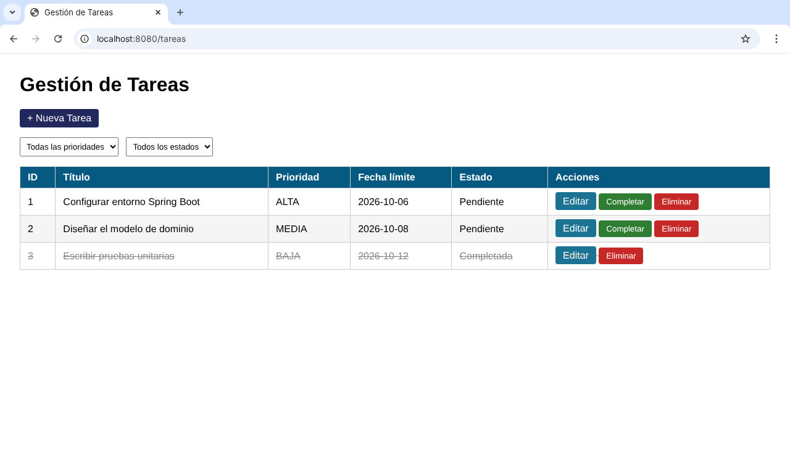

Filtro por prioridad ALTA y estado Pendientes con `@RequestParam` (se ve la URL con los parámetros):

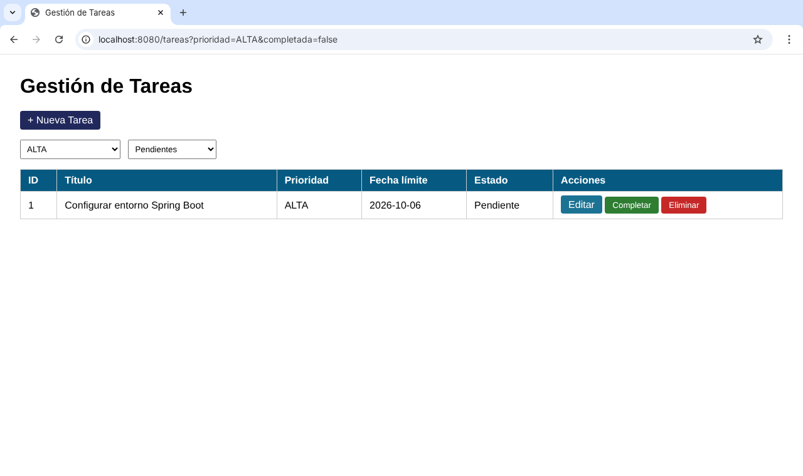

Formulario enviado con el título vacío: aparece solo "El título es obligatorio" y se conservan la descripción, la prioridad y la fecha:

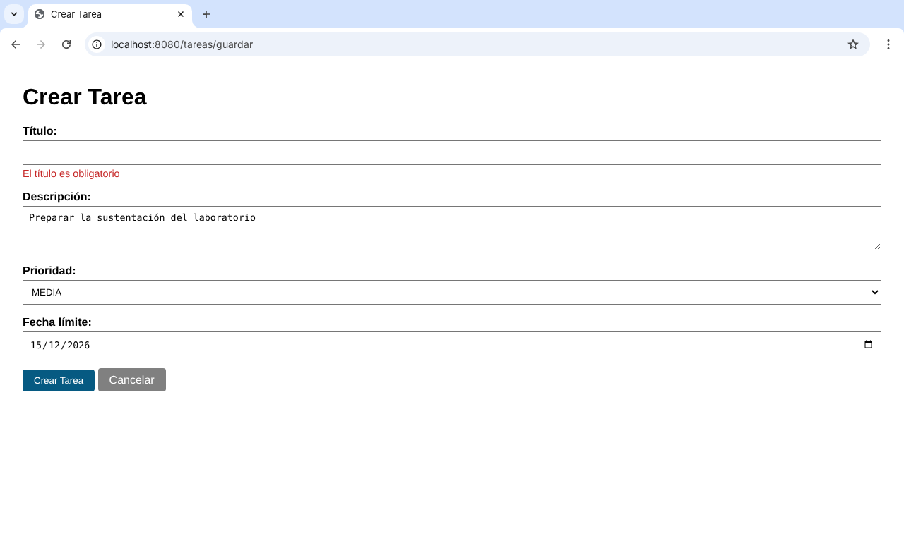

Formulario de edición prellenado, incluida la fecha:

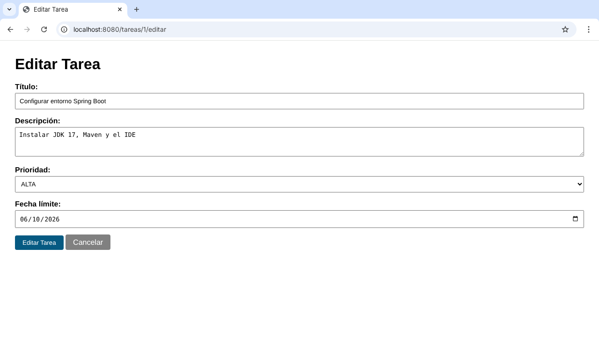

Después de presionar "Completar" en la tarea 2: queda Completada, el botón desaparece y la URL vuelve a `/tareas` por el patrón PRG:


**API REST (Parte 2)**

GET con filtros, 200 OK:

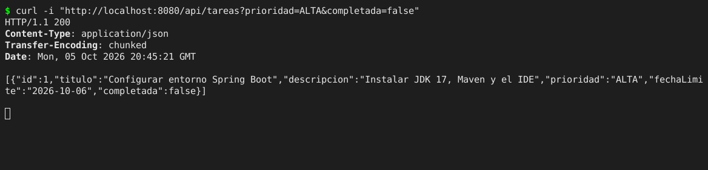

POST válido, 201 Created con `Location: /api/tareas/4`:

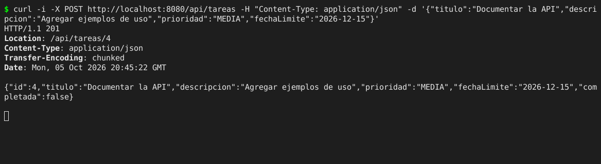

POST con título vacío, 400 Bad Request con JSON de errores por campo:

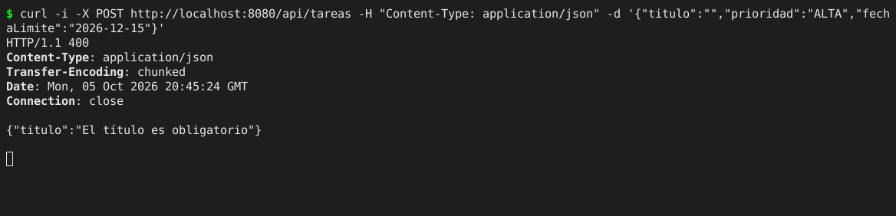

PUT para reemplazar la tarea y PATCH para completarla, los dos con 200 OK:

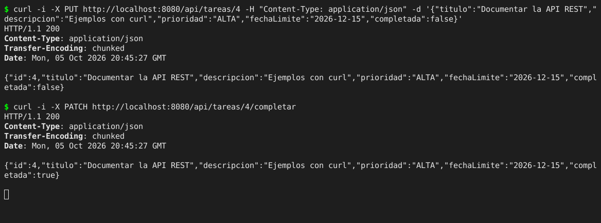

DELETE con 204 No Content y luego GET de la misma tarea con 404 Not Found:

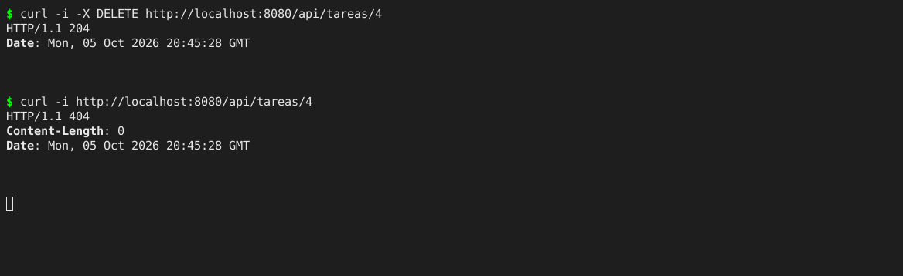

**Las dos capas comparten los mismos datos**

La tarea 4 creada con POST en la API aparece en la vista web:

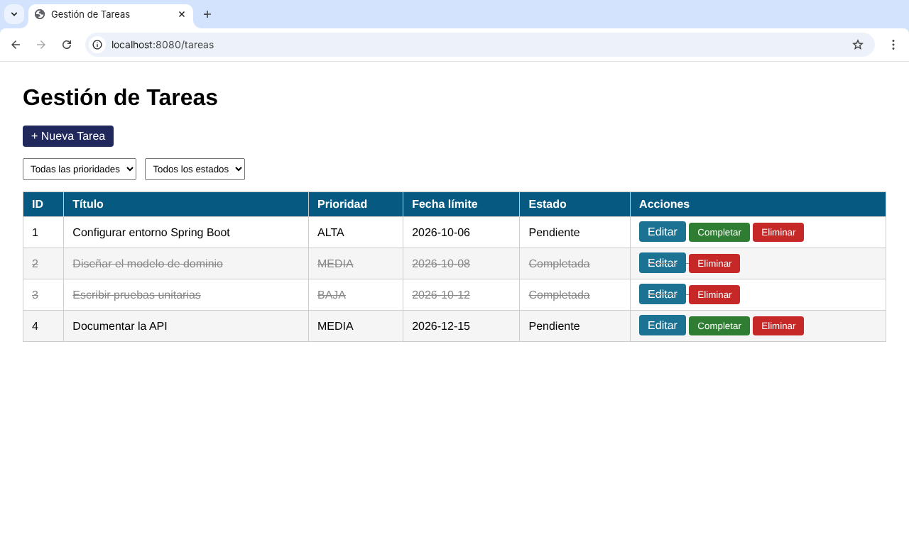

Después del DELETE en la API, la tarea 4 ya no aparece en la vista web:

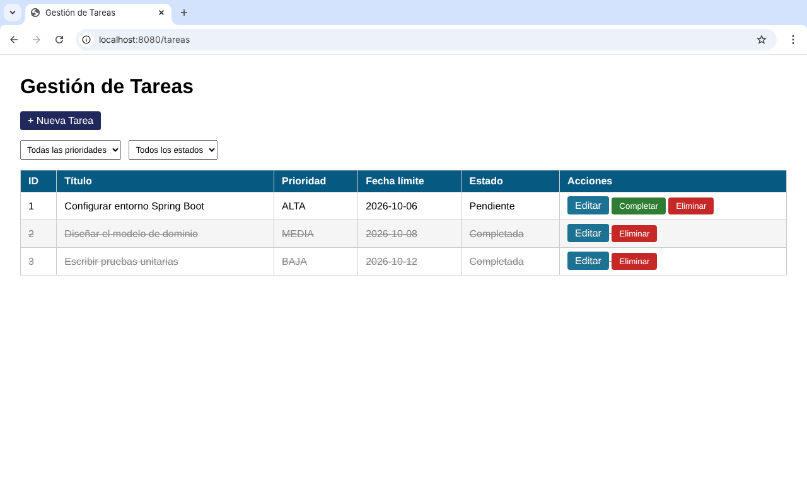
